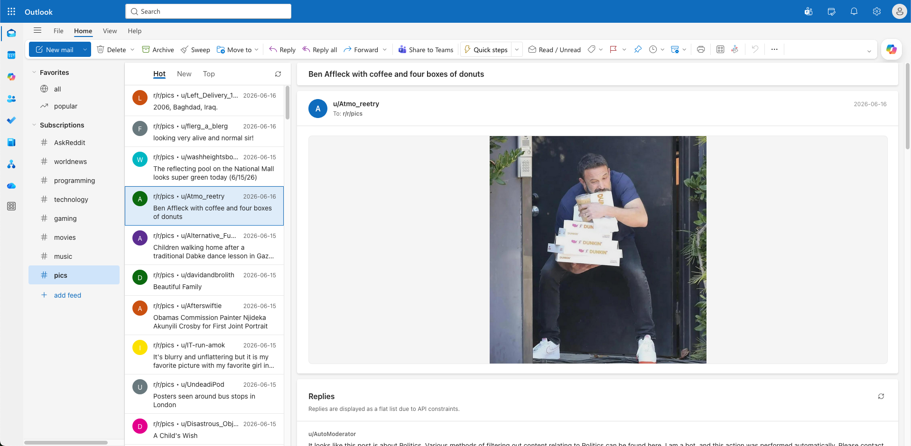
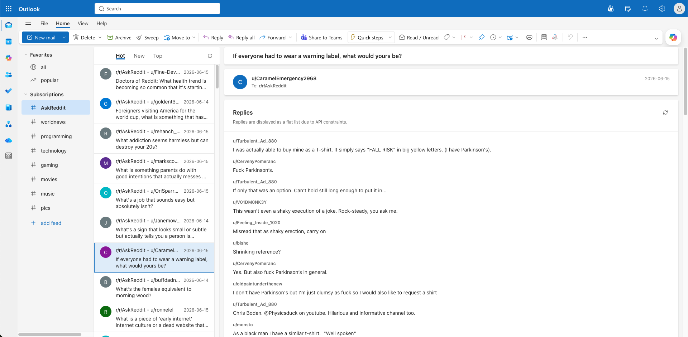

# Reddit365

**[reddit365.davisstanko.com](https://reddit365.davisstanko.com)**

A UI clone of Microsoft New Outlook that displays Reddit content in place of emails. The tab title reads "Outlook" and uses the real Outlook favicon, so it blends into a browser tab bar like any other work app.

## Features

- **Subreddits as folders** — your subscribed subreddits appear as email folders in the left sidebar. Add, remove, and drag to reorder them.
- **Post feed** — posts are listed as emails in the middle column. Sort by Hot, New, or Top.
- **Reading pane** — selecting a post opens its content and comments on the right, formatted as an email thread. External image links (like `i.redd.it`) are automatically expanded into inline images.
- **Disguise details** — tab title, favicon, and overall Fluent Design aesthetic match New Outlook closely enough to pass a casual glance.

## Usage

No login required. Open the app and start browsing.

- **Add a subreddit:** click "New Folder" or the "+" button in the sidebar and enter a subreddit name.
- **Remove or reorder:** hover a folder and click the three-dot menu to remove it, or drag it to a new position.
- **Read a post:** click any item in the feed to load it in the reading pane.

## Limitations

Reddit heavily restricts unauthenticated API access, so Reddit365 uses public RSS feeds rather than Reddit's JSON API. A few things aren't possible as a result:

- **Read-only** — no login, voting, or replying.
- **Flat comments** — the RSS feed doesn't include threading, so replies to comments look identical to top-level comments. The feed is also capped at 50 comments, sorted by Best only.
- **Rate limiting** — Reddit throttles RSS requests. The app handles this with exponential backoff, but switching subreddits quickly may cause a delay.
